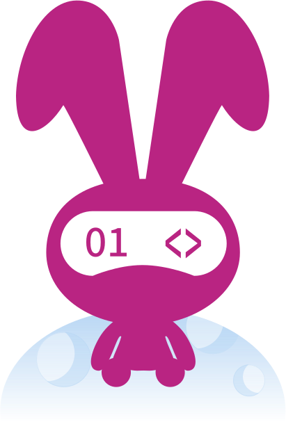
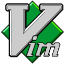

# CAIMEO
### A student interested in math and computer science.

$$
\text{Life} = \int_\text{birth}^{\text{death}} \text{study} \ dt
$$

- 🌱 Learning Cohesive Homotopy Type Theory
- 🤔 Researching Programming Languages Theory
- 📝 Regularly write notes and blogs ([The Rabbit Hole](https://caimeo.space))
- 🔭 Working on **QuickCheck**, **Proof Assistant** and **MoonBit Toolchains**

### Languages and tools

&nbsp;
&nbsp;
&nbsp;
&nbsp;
&nbsp;
&nbsp;
&nbsp;
&nbsp;
&nbsp;
&nbsp;
&nbsp;
&nbsp;
&nbsp;
&nbsp;
&nbsp;
&nbsp;
&nbsp;
&nbsp;
&nbsp;
&nbsp;
&nbsp;

### Interests

- Algebra
- MacOS ~~Arch Linux and NixOS~~
- Category Theory and Logic
- Type Theory
- Theoretical Computer Science
- Programming Language Theory
- Quantum Physics and Quantum Computing
- String Theory
- Classical Music
- Minecraft
- Puzzling Games
